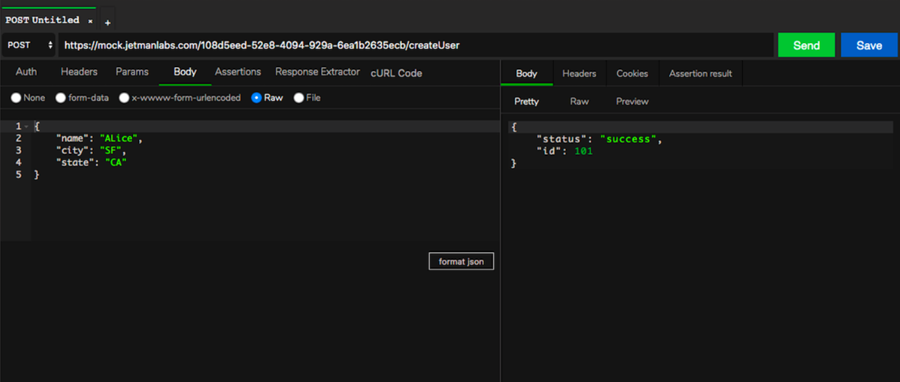

# How to Use Jetman app

* Jetman is an API management platform to allow users to design, develop, test and collaborate with others to accelarate API development. Jetman platform provide secure ecosystem by allowing users to keep all their API data on their local premises and not worry of their data and credentials being shared to any third part cloud provider.
* Jetman saves all data on user premises, and users can use github or similar platform to collaborate within their organizations.

## Jetman Products and Offerings
- Jetman Studio - Manage, Design and develop API's
- Jetman Runner - Run entire project or suites for QA/Testing
- Jetrunner-cli - Run suites in headless mode from CLI for CI integration
- Jetrunner Marketplace - Publish API's to public marketplace for sharing
- Jetrunner Documentation - Generate API documentation from your suites.

## Table of Contents (App and CLI)
- [Getting Started](#getting-started)
- [Create Project](#create-project)
- [Import Project](#import-project)
  - [Import from Postman](#import-from-postman)
  - [Import from Jetman](#import-from-jetman)
- [Manage Suites and Requests](#manage-suites-and-requests)
  - [Create suites and add Requests](#create-suites-and-add-requests)
  - [Modify suites or Requests](#modify-suites-or-requests)
  - [Reorder/Move suites or Requests](#move-suites-or-requests)
- [Response Assertions and Validations](#response-assertions-and-validations)
- [Response Extractor and Run-time Variables](#response-extractor-and-run-time-variables)
  - [Extract and save response fields in runtime-variables](#extract-and-save-response-fields-in-runtime-variables)
  - [How to use runtime-variables in requests](#how-to-use-runtime-variables-in-requests)
  - [Example-Automating Authentication using response extractor](Example-Automating-Authentication-using-response-extractor)
- [Env Variables](#Env-Variables)
  - [Run suites with various env using user defined env](#Run-suites-with-various-env-using-user-defined-env)
- [Switch Projects](#Switch-Projects)
- [Runner Module](#Runner-Module)
  - [How to run all requests using runner](#How-to-run-all-requests-using-runner)
  - [Using Env and Iterations](#Using-Env-and-Iterations)
  - [Understanding Responses and Assertions](#Understanding-Responses-and-Assertions)
- [Share Project/Suites](#Share-Project/Suites)
- [Import and Export from Curl](#Import-and-Export-from-Curl)
  - [Import from Curl](#Import-from-Curl)
  - [Export to Curl](#Export-to-Curl)
- [Publish to Marketplace](#Publish-to-Marketplace)
- [Advance Topics and Debugging](#Advance-Topics-and-Debugging)
  - [Opening Console window](#Opening-Console-window)
  - [Print Response Object in Console](#Print-Response-Object-in-Console)
  - [Select Env and Print Varaibles](#Select-Env-and-Print-Varaibles)
  - [Print Runtime Varaibles](#Print-Runtime-Varaibles)
- [Jetrunner-cli to run suites from CLI](#Jetrunner-cli-to-run-suites-from-CLI)
  - [Installation and Usage](#Installation-and-Usage)
  - [Command Line Options](#Command-Line-Options)
- [Marketplace](#Marketplace)
  - [Publish to Marketplace](#Publish-to-Marketplace)
  - [Import from Marketplace](#Import-from-Marketplace)
  - [Edit Marketplace Published API's](#Edit-Marketplace-Published-API's)
- [FAQ's](#FAQ's)

# Getting Started

[Watch the video](https://youtu.be/8pbItxrKSFc)
## Download Jetman App

[Windows Installer](https://github.com/jetmanlabs/app/releases/download/v23.4.25/jetman-Setup-23.4.25.exe)

[MacOS Installer](https://github.com/jetmanlabs/app/releases/download/v23.4.25/jetman-23.4.25.dmg)

## Send First Request

As you open app, Jetman app creates default project. you can check path from setting icon in bottom right footer.
If you want to create a create a new project with user defined path in your local filesystem to save your suites and requests, refer [Create Project](#create-project).

##### Steps to send your first request
- Select Http method from 'GET' method dropdown.
- Enter request url in 'Enter Request url here' text bar.
- Add headers,auth,body as needed.
- Click on Send button on the right (green color)
- Response will be displayed in right panel and response time and status code on right top side.

# Create Project
Hello create project
sample mp4 screen recorder is good, instead of images.

https://user-images.githubusercontent.com/48234672/164883466-f185123f-85ae-4775-b92a-a022270795cc.mp4

